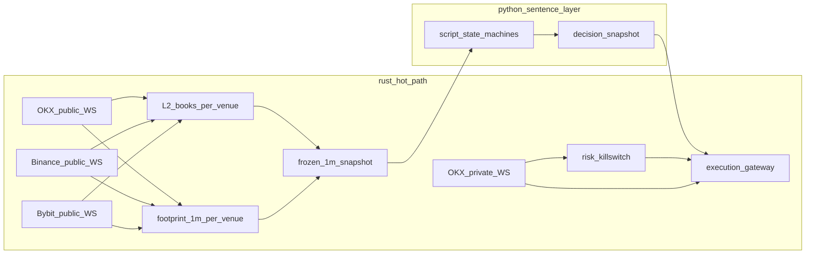

# SOL/SUI 訂單流系統實作計劃

## 先回答：Cursor 能不能開多 Agent 一起跑

可以同時開很多個 Agent，但它們**不會自動互相對話、也不會自動把程式合併在一起**。

- **Agents 視窗**（命令面板 `Open Agents Window`）可並行管理多個本地 / Cloud / SSH Agent。同一個 repo 請用 **worktree**，避免互相覆蓋。
- **同一個對話**裡，後續訊息預設是排隊，不是平行。要平行可用 `/multitask`、或讓 Agent 一次派出多個 **subagent**（子 Agent 做完只回報父 Agent）。
- **Cloud Agent**（[cursor.com/agents](https://cursor.com/agents)）可開「你想要的那麼多」條，各跑在獨立 VM 與分支；同一條 Cloud Agent 一次只能有一個進行中的 run。
- **`/best-of-n`**：同一任務多模型各做一份，你自己挑贏家，不會自動 merge。
- **`/side`**：旁邊開子對話，要用 `@` 把結果拉回主對話。

第一次用：`Ctrl+I` 開 Agent；要很多條並行就開 Agents 視窗。把「多 Agent 一起想」理解成「你當指揮，或一個父 Agent 派工」，不要理解成「它們自己開會寫同一份代碼」。

本交易系統建議先由**這一條 Agent 當單一指揮**把骨架與契約寫完；需要平行時再拆 ingest / footprint / risk 等獨立 worktree，最後由你或父 Agent 合併。

---

## 實作範圍與契約（已鎖定，不得在代碼裡偷改）

來源：[specs/orderflow-1m-tokyo-system-elements.md](specs/orderflow-1m-tokyo-system-elements.md)、[specs/orderflow-footprint-school-guide.md](specs/orderflow-footprint-school-guide.md)、[specs/orderflow-rust-python-boundary.md](specs/orderflow-rust-python-boundary.md)。代碼不得另立學派。**死守足跡圖流派**：不算 Market Profile / VWAP / Naked POC。

- 綠地專案（目前工作區無 git 庫）：在 `/agent` 建套件，執行時開 `cursor/orderflow-tokyo-1m-59ee`。
- 語言：**熱路徑 Rust**（tokio、三所 WS、L2、1m 足跡、OKX 私有解碼、下單/撤單寫出）；**句子層 Python 3.12+**（腳本 A–G、參數、對帳編排、日報）。交接用 PyO3 凍結 1m 快照；禁止生產熱路徑用 Python 解析行情或 pandas 組矩陣。細節見邊界文件。
- 主時鐘：交易所事件時間切 1 分鐘棒 `[t, t+60)`；僅 **closed** 可開倉決策；forming 只准撤單 / 風控 / 預警。已閉合棒禁止改寫；晚到成交只加 `late_trade` 品質計數。
- 宇宙：SOL 主樣本、SUI 驗證樣本；**參數表分開**；相關 beta 共用風險帽。實盤開啟順序永遠 SOL 先於 SUI。
- 交易所：**三大所公共 WebSocket 全開**——Binance USD-M、OKX linear、Bybit linear。OKX 為**執行所**，用自己的成交組進出場足跡。Binance 與 Bybit **平級共振所**（不是備援）：配置 `off | k_of_n | all`，另可開鉛滯研究或獨立價差池。禁止隱含「看 A 打 B」把 Binance/Bybit 價當 OKX 限價。一所阻塞不得拖死另外兩所。
- 模式：`shadow` / `sim` / `live_small` / `live` 共用同一套特徵與狀態機。參數未填或品質不健康時，硬禁止 live 開倉。
- 腳本 A–G 全部計算、全部可開關；每標的同時只准一個主腳本 `in_position`。E 預設只減倉不反手。不實作 Naked POC 磁鐵、不實作 VWAP 回歸。
- 數字：全部進 `params/sol.toml`、`params/sui.toml` 佔位，代碼只讀 `<PARAM>`，不在原始碼寫死教材 400%。

## 程序與資料流

七個崩潰域（可先同機多進程，介面先定死）：

硬規則：決策卡死時，risk 仍能撤單 / 平倉。REST 權重優先級寫死：風控單大於撤單大於平倉大於開倉大於查詢。忙時降載：先停研究宇宙與新開倉，最後才動風控。

## 建議目錄（每個模組對應規格章節）

Rust workspace（熱路徑）：

- `crates/orderflow-domain`：Trade、Bar1m、QualityVector（含 `binance_*` / `okx_*` / `bybit_*`）、Venue、SymbolContract、TakerSide。適配層只准輸出 `taker_buy` / `taker_sell`。
- `crates/orderflow-ingest`：`binance` / `okx` / `bybit` 三套 WS+REST 適配；Bybit taker 方向與時間戳單位必須有黃金測試。
- `crates/orderflow-clock`：NTP 健康、三時間戳、收棒寬限、暖機根數。
- `crates/orderflow-book`：分所 snapshot+delta、checksum、重建、牆追蹤、成交核對啃量 vs 撤單。
- `crates/orderflow-footprint`：標的級 bucket（SOL/SUI 分表）、空桶不得當 0 去除、斜對角、堆疊、混亂棒、未完成、excess、delta/CVD、發起/吸收/衰竭、tape speed、當根 POC/VA、近窗量堆（多根桶加總）；**三所各一張矩陣，禁止加總**。不算 VWAP、不算日盤 TPO。
- `crates/orderflow-exec`：OKX 下單/撤單、冪等 client id、ACK、kill switch 熱路徑。
- `crates/orderflow-py`：PyO3，把凍結 1m 快照交給 Python。

Python（句子與維運）：

- `python/orderflow/scripts/`：A–G 生命週期 `inactive → watch → armed → executed → manage → exit → cooldown`。
- `python/orderflow/decision/`：讀快照組句子；寫不出失效則不准 armed。
- `python/orderflow/context/` 與 `regime/`：可先在 Python 用 Rust 已聚合的 1m 序列滾近窗量堆與擺動；若成為熱點再下沉 Rust，但輸入必須是 Rust 棒，禁止另用 OHLC，禁止滾 VWAP / 日盤 Profile。
- `python/orderflow/reconcile/`、`ops/`：對帳編排、日報、告警。
- `params/sol.toml`、`params/sui.toml`：含共振 `off|k_of_n|all`。
- `tests/`：Rust 單測（對角失衡、空桶、棒不可變、三所方向適配、book 中毒、佇列有界）+ Python 單測（腳本互斥、共振 not_evaluated 不得用舊棒）。
- `deploy/tokyo/`：ap-northeast-1、NTP、磁碟水位、IP 白名單注意事項（文件，不當秘密）。

## 分階段交付（後一階段不得回頭改契約）

**階段 0 — 專案與配置骨架（已完成）**  
Cargo workspace、PyO3、Python 套件、lint/test、`params/*.toml` 全佔位（含三所 endpoint 與共振模式）、模式開關、日誌 JSON（無密鑰）。  
此階段結束：能 `shadow` 啟動並因為「參數未校準」而拒絕 live。  
命令：`cargo run -p orderflowd -- --mode shadow --once` 與 `PYTHONPATH=python python3 -m orderflow --mode shadow --once`；`--mode live` / `live_small` 因 `calibration_complete = false`（觀察稿 ≠ 樣本外驗證）**拒絕**。執行 crate 即使把旗標翻開也下不了單。

**階段 1 — OKX 公共成交 + 1m 棒契約（Rust）**  
事件時間切棒、品質向量、暖機、journal。單測：亂序 / 晚到 / 重連不改寫已閉合棒。先只跑 SOL。

**階段 1b — Binance 與 Bybit 公共 WS（Rust）**  
與 OKX 同一內部事件型別。Bybit taker 方向黃金測試必須先綠。三所有界佇列，滿則該所 `gap`，不阻塞 OKX。此階段仍不算共振開倉。

**階段 2 — 足跡矩陣（Rust，三所各算）**  
bucket、斜對角、堆疊、混亂棒、excess、未完成、delta/CVD。用錄製的一小段 SOL trades 做 golden replay（對齊矩陣，不是對齊盈虧）。三所 replay 分開對齊。

**階段 3 — L2 + 對讀旗標（Rust，分所）**  
書壞則該所盤口特徵作廢。執行所 book 壞：禁止依賴盤口的開倉。共振所 book 壞：該所對讀 `not_evaluated`。

**階段 4 — 位置與制度 + 共振欄位**  
近窗量堆 / 擺動 / 量堆被接受旗標 / 清算與擁擠旗標。不算 VWAP、不算日盤 Profile。三所方向寫進快照；共振預設 `off`（仍記錄），不驅動下單價。

**階段 5 — 腳本狀態機 A–G + 決策快照（Python 讀 Rust 快照）**  
全進影子日誌。互斥、cooldown、硬否決表一次做完，不要先做 A 再漏否決。

**階段 6 — 模擬撮合 + 風控 + 對帳**  
本地用即時盤口假成交；kill switch、日虧、距強平緩衝、降載順序。無 API 金鑰也必須能跑完這段測試。

**階段 7 — 執行網關（仍默認 shadow）**  
接私有流，但 live 開關與參數校準閘門雙鎖。SUI 影子並行，參數檔獨立。

**階段 8 — 東京運行面**  
監督重啟、崩潰熔斷（避免死循環打 API）、日誌輪轉、規格變更（tick size）觸發重建矩陣與撤單、資金費黑窗佔位。

**階段 9 — 填數字（本計劃執行期不做完，但接口要先留好）**  
校準順序：SOL 桶寬 → 失衡/堆疊記錄閾 vs 開倉閾分開 → 流動性與時段門檻 → 再談 SUI。校準用 replay + 影子統計，不在 IDE 裡手填「教材 400%」。

## 測試與完成定義

- 每個規格元素在代碼裡找得到對應欄位或明確 `not_evaluated`；發現行為不在兩份規格裡，先改規格再改代碼。
- 影子跑滿連續 24h：無靜默丟棒、無 book 中毒後仍開倉、重啟後倉與單與交易所一致（無倉時也要對帳通過）。
- 未填參數時任何路徑都下不了 live 開倉單。
- 不在本階段宣稱勝率或上真實資金。

## 刻意不做（避免把計劃做成另一套系統）

- 不實作 RSI/形態學開倉、不實作 Market Profile / VWAP / Naked POC、不實作未聲明跨所搶單、不在第一期上迷因幣、不上 DGX、不把回測偷換成 OHLC 假裝足跡。
- 不在 Python 熱路徑雙寫第二套足跡；不把 Bybit 當可選插件延後到「有空再說」。
